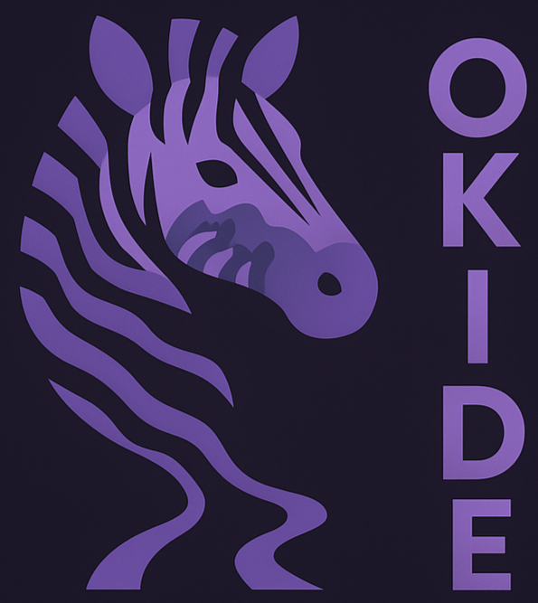
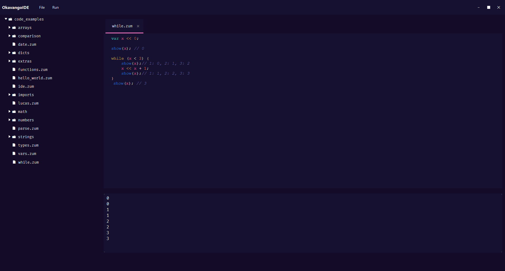

    

OKavangoIDE

The official Zumbra IDE

<blockquote style="font-size: 16px; font-style: italic;">
  ⚙️ <em>ZUMBRA is a simple, fun, and expressive programming language made for learning, experimenting, and enjoying the beauty of code. OKavangoIDE or, for close friends, <strong>OKIDE</strong> was created to help you enjoy coding with Zumbra, featuring syntax highlighting, file management, and a smooth development experience.</em>
</blockquote>

🚀 Features

<ul style="font-size: 16px; line-height: 1.6;">
  <li>🎨 Real-time syntax highlighting for Zumbra</li>
  <li>📂 File explorer with in-editor editing</li>
  <li>💾 Save and manage your Zumbra scripts easily</li>
  <li>🧠 Simple, minimal UI for distraction-free coding</li>
  <li>☕ Powered by Java</li>
</ul>

💡 Tip:

Press <code>Ctrl + S</code> to quickly save your file, or right-click a folder to create a new Zumbra file!

🎨 The interface:

    

  Built with ❤️ • project in progress 🚧

